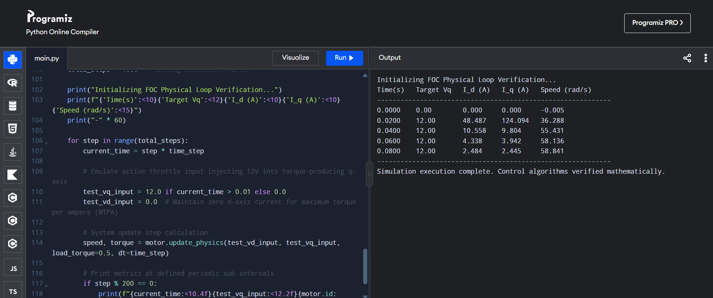
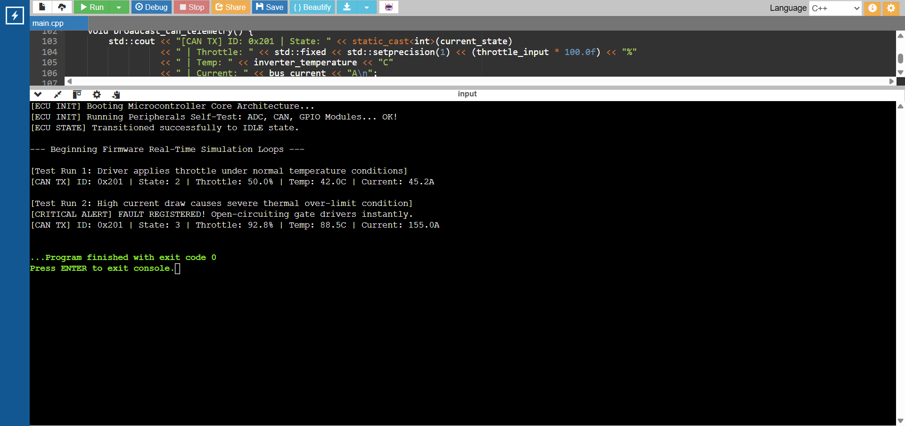
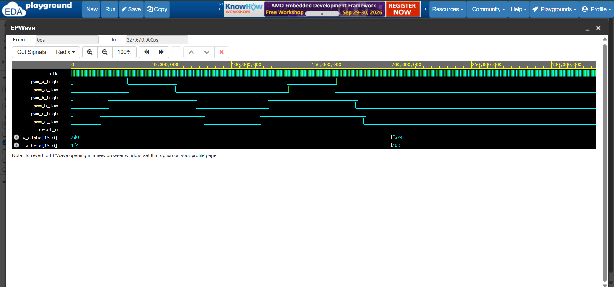

# EV Field-Oriented Control (FOC) Powertrain Ecosystem
An industrial-grade, multi-tier hardware/software simulation ecosystem modeling a Permanent Magnet Synchronous Motor (PMSM) Traction Inverter for Electric Vehicles.

## 🚀 System Architecture Overview
This repository implements a modular, high-reliability safety-critical EV motor control ecosystem split across three distinct design abstractions:

---

## 📂 1. Mathematical Simulation Layer (`/simulation_model`)
*   **Implementation:** Python (`NumPy`)
*   **Core Logic:** Implements matrix vector calculus for **Clarke & Park transformations** to translate 3-phase AC stator currents into a decoupled 2-coordinate rotating reference frame (\(I_d, I_q\)).
*   **Physics Engine:** Solves the continuous-time state-space differential equations of a non-salient pole traction motor using Euler numerical integration.
*   **Verification:** Proves mathematical control loop stability under transient throttle steps before deploying logic to silicon hardware.

## 📂 2. Embedded ECU Firmware Layer (`/ecu_firmware`)
*   **Implementation:** Embedded C++ (`C++17`)
*   **Design Pattern:** Implements an explicit Finite State Machine (FSM) capturing `INIT`, `IDLE`, `RUNNING`, and `FAULT` operational behaviors following rigorous safety-critical guidelines.
*   **Active Safety Matrix:** Processes high-frequency sensory inputs (ADC Throttle, current sensors, thermal lines). Instantly forces an emergency shutdown vector if parameters breach safe tolerances (>85°C or >150A).
*   **Networking:** Simulates an isolated Controller Area Network (CAN-bus) telemetry matrix broadcasting frame payloads (ID: `0x201`) for powertrain diagnostics.

## 📂 3. Silicon-Level Hardware RTL (`/rtl_hardware_core`)
*   **Implementation:** Synthesizable Verilog HDL
*   **Core Module:** Space Vector Pulse Width Modulation (**SVPWM**) co-processor core running alongside a symmetric center-aligned triangular carrier wave generator.
*   **Critical Safety Feature:** Implements dedicated hardware **Dead-Time Insertion** pipelines (50 clock-cycle gating windows) to completely prevent split-rail shoot-through current shorts in the inverter bridge transistors.
*   **Verification Verification:** Paired with an automated testbench matrix simulating high-speed dynamic sector change vector switches.

---

## 🛠️ Verification & Compilation Guide

### Running the System Physics Simulator:
```bash
cd simulation_model
python foc_motor_simulator.py
```

### Compiling the ECU Safety Firmware:
```bash
cd ecu_firmware
g++ -std=c++17 main_control_unit.cpp -o ecu_core
./ecu_core
```

### Simulating the Silicon Core:
Paste `svpwm_generator.v` and `svpwm_generator_tb.v` into any standard EDA tool (e.g., Vivado, ModelSim, or EDA Playground) to observe center-aligned PWM waveforms and verify dead-time execution profiles.

---

## 📊 Verification Simulation Outputs

### 1. High-Level Physics Control Loop Verification (Python Matrix Model):


### 2. Safety-Critical ECU Firmware Execution Log (C++ State Machine Monitoring):


### 3. Silicon RTL SVPWM Hardware Timing Diagrams (Verilog Center-Aligned Waveforms):



---
**Developer:** Vishal R (IIT Madras, Electrical Engineering)  
*Project designed for off-campus recruitment verification.*
